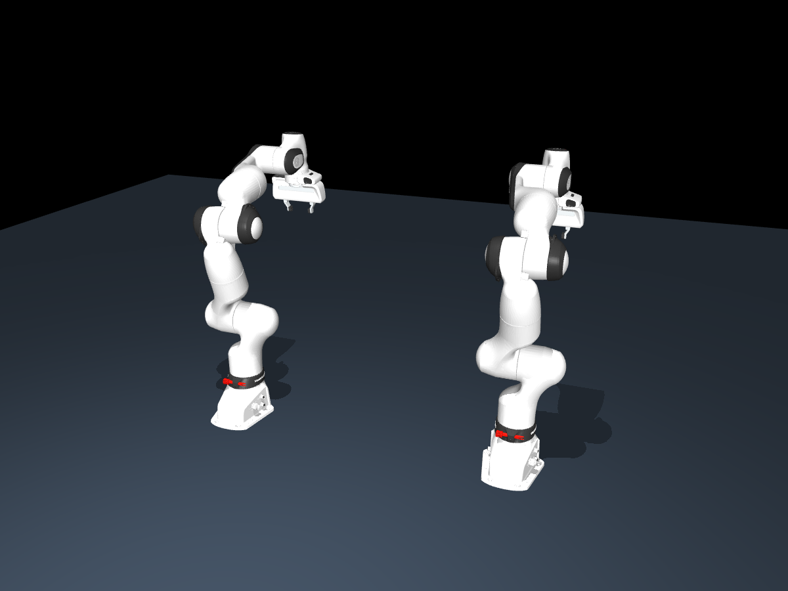
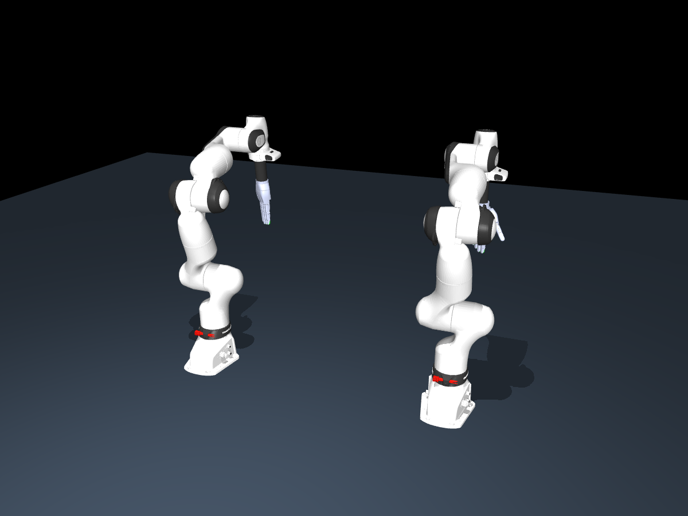
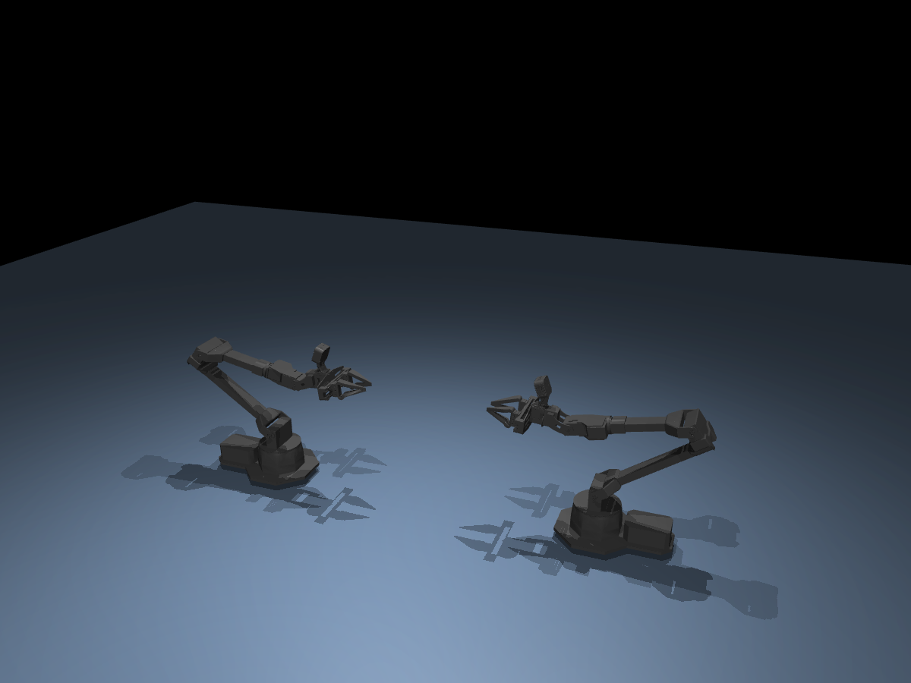
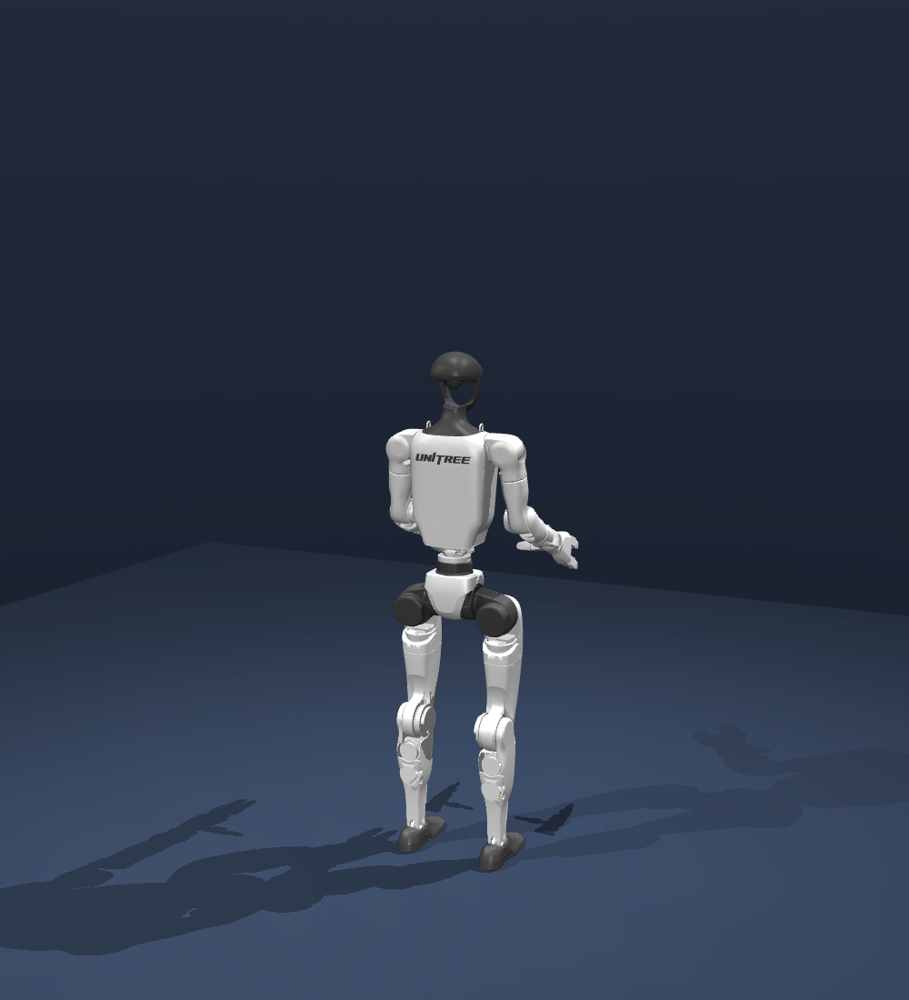
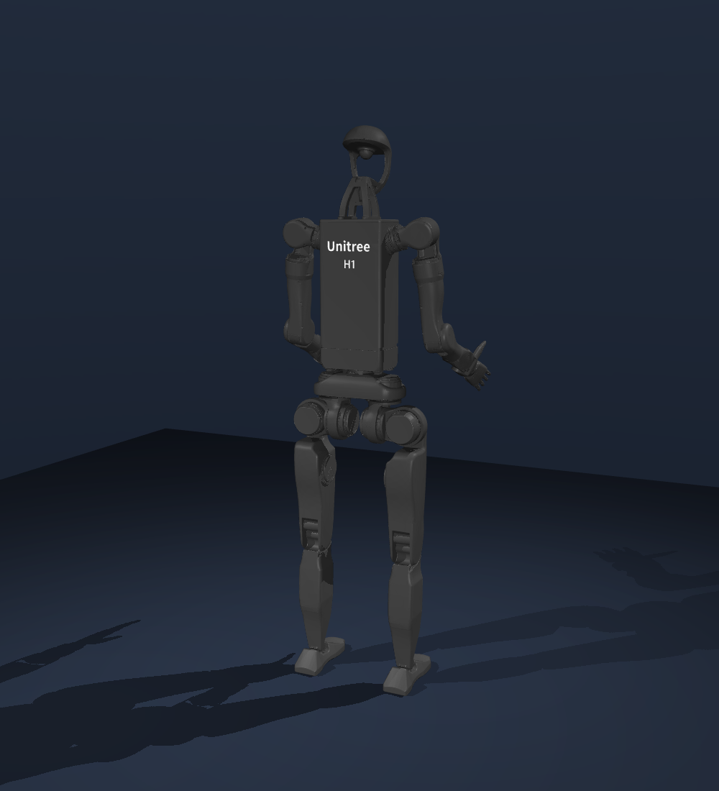

**[🌐 Project website & demos](https://cskrren.github.io/real2gym-site/)**

[中文](docs/README.zh-CN.md) | **English**

**From human or robot videos to reconstructed scenes, executable actions, and validated simulation variants.**

[Get started](#get-started) · [Hardware](#hardware-selection) · [Pipeline](docs/guides/pipeline.md) · [Examples](examples/README.md) · [Citation](#citation)

Real2Gym uses **GPT6 Astra** to coordinate scene reconstruction, action adaptation and feedback-driven refinement across **Blender and MuJoCo**.

## Highlights

- **Human & robot demonstrations** — single-view or multi-view videos, with motion retargeting to selected robot hardware.
- **Aligned scenes and actions** — reconstruct objects, robots and cameras; review interaction keyframes and correct mismatches.
- **Physics-validated execution** — run native MuJoCo interactions and bind task results to the model and trajectory used.
- **Validated scene augmentation** — vary geometry, target placement, table height, backgrounds and appearance; adapt actions and revalidate each variant.

## Three steps

| Step | What happens | Deliverables |
| --- | --- | --- |
| **1. Reconstruct** | Initialize geometry, build complete objects and align the scene to video | Blender scene, robot and cameras |
| **2. Execute** | Recover or retarget motion, refine contacts and verify the complete task | MuJoCo model, native trajectory, **Real / Blender / MuJoCo RGB** comparisons |
| **3. Augment** | Combine mechanical changes with appearance variations and test execution | Validated scene family with parameter changes and run evidence |

## Get started

```bash
git clone https://github.com/cskrren/Real2Gym.git
cd Real2Gym
conda create -n real2gym python=3.11 -y
conda activate real2gym
python -m pip install -r requirements-validation.txt
```

The environment above installs the evidence-validator dependencies.

Install the complete [`skills/real2sim-prompt`](skills/real2sim-prompt/SKILL.md) directory in your agent's skill location. For Codex, use `~/.codex/skills/real2sim-prompt`; the invocation remains **`$real2sim-prompt`**.

Prepare Blender, MuJoCo, geometry models and robot assets using the [setup guide](docs/guides/getting-started.md), then provide your video and target hardware:

```text
Use $real2sim-prompt to run Real2Gym steps 1 and 2.
Input: /absolute/path/demo.mp4
Source actor: human
Target robot: dual FR3 + Franka Hand
Output: /absolute/path/runs/demo
Deliver the reconstructed scene, native execution evidence,
and frame-matched Real / Blender / MuJoCo RGB comparisons.
```

For step 3, start from an accepted scene and specify augmentation and retry budgets. [Robot, human and augmentation examples →](examples/README.md)

## Hardware selection

Choose the target robot for human-to-robot retargeting, or retain the source robot for same-hardware demonstrations.

<table>
<tr>
<td align="center" width="33%"><br><b>Dual FR3 + Franka Hand</b></td>
<td align="center" width="33%"><br><b>Dual FR3 + Wuji Hand</b></td>
<td align="center" width="33%"><br><b>Dual FR3 + Sharpa Wave</b></td>
</tr>
<tr>
<td align="center" width="33%"><br><b>ALOHA 2</b></td>
<td align="center" width="33%"><br><b>G1 + Dex3-1</b></td>
<td align="center" width="33%"><br><b>H1-2 + stock five-finger hands</b></td>
</tr>
</table>

- **Parallel grippers:** dual FR3 + Franka Hand or ALOHA 2.
- **Dexterous hands:** dual FR3 + Wuji Hand or Sharpa Wave.
- **Humanoids:** G1 + Dex3-1 or H1-2 + its stock five-finger hands.
- **Custom hardware:** provide a complete URDF/MJCF and end-effector description.

[Configuration details and end-effector options](skills/real2sim-prompt/references/target-robot-selection.md) · [Model preview sources](assets/hardware/README.md)

## Citation

Please cite Real2Gym and record the exact tag or commit used:

```bibtex
@software{real2gym,
  author = {{Real2Gym Contributors}},
  title = {{Real2Gym: Real-World Videos to Executable Robot Simulations}},
  year = {2026},
  url = {https://github.com/cskrren/Real2Gym}
}
```

## Acknowledgements

We thank **GPT6 Astra** for its assistance in developing and refining Real2Gym, and the following projects for their ideas and reference implementations:

- [GPT6-real2sim](https://github.com/lingxiao-guo/GPT6-real2sim)
- [Real2Sim_GPT6_ASTRA](https://github.com/hku-sail/Real2Sim_GPT6_ASTRA)
