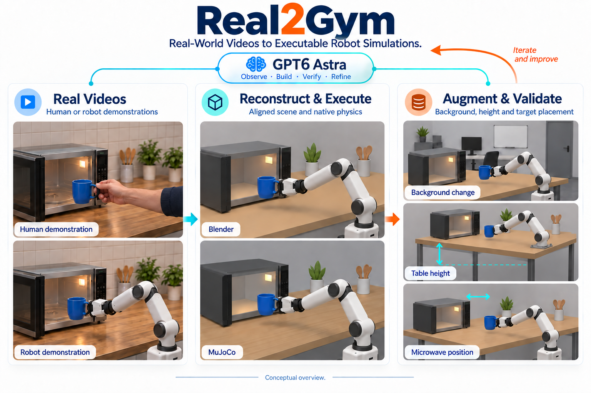

# Real2Gym

### Real-World Videos to Executable Robot Simulations



*AI-generated conceptual overview: human or single-arm demonstrations, corresponding Blender and MuJoCo scenes, and background/table-height/microwave-position variants; not experimental screenshots. [Artwork provenance](assets/README.md).*

**Reconstruct the scene. Reproduce the interaction. Build a family of validated simulations.**

Real2Gym is an agent-driven Real2Sim framework for turning **robot or human demonstrations** into structured Blender scenes, executable MuJoCo tasks, and augmented simulation environments. **GPT6 Astra** coordinates the workflow: inspect observations, generate and revise scene/control code, review keyframes, and use tool feedback to iterate. Blender and MuJoCo provide the rendering and physical execution evidence.

[Get started](docs/guides/getting-started.md) · [Pipeline](docs/guides/pipeline.md) · [Validation](docs/guides/validation.md) · [中文介绍](docs/README.zh-CN.md) · [Citation](#citation)

> **Implementation status:** this repository distributes the complete **v5.2 workflow skill and evidence validators**. Reconstruction and action adaptation are agent-driven and still require scene-specific code and external tools. It does not yet provide a universal video-to-simulation command, a Gymnasium environment API, or a policy-training engine. “Gym” describes the intended simulation training ground.

## What it does

| Input | Reconstruction and execution | Output |
| --- | --- | --- |
| Single-view or multi-view robot videos | Recover the scene, use measured robot state when available, fit motion otherwise | Blender scene, MuJoCo model, native trajectory and task evidence |
| Human demonstration videos | Select target hardware, retarget object-relative interactions, validate physical contacts | Robot-executed simulation with original/adapted trajectory labels |
| An accepted simulation | Vary geometry, placement, orientation and support height; adapt actions and add appearance variation | Validated scene variants with parent-child provenance |

### 1 · Reconstruct a grounded scene

Initialize first-frame geometry with **MoGe-3 for single-view input** or **Pi3X for multi-view input**. Build complete foreground and core background meshes primarily from RGB silhouettes, structure and occlusion. Use only the first-frame point cloud as a geometric reference; up to ten later sparse RGB time indices help reveal hidden surfaces. Import the robot from URDF/MJCF and iteratively review camera alignment, object relationships and geometry.

### 2 · Make the interaction executable

Discover real interaction events, recover or retarget motion, and review every event keyframe in every available view. Configure MuJoCo contacts, cavities, inertial properties and actuators; calibrate contact execution and run a complete native regression. Drive the Blender scene with that native trajectory, refine foreground/background materials and lighting, and export **Real RGB / Blender RGB / MuJoCo RGB** comparisons with explicit frame mapping.

### 3 · Expand into validated environments

Probe individual change ranges, sample **1–3 mechanical edits** per candidate, and reduce the same edits modestly when execution fails. For the original and accepted mechanical scenes, add textures, realistic distractors, complete backgrounds and moderate lighting variation. The candidate structure is **(1+N) × (1+M)**; every new scene is revalidated, and failed attempts remain recorded. Augmented scenes have no newly paired Real RGB.

## Get started

Run these commands from a terminal. The Python dependencies below are for **validation only**, not the reconstruction stack.

```bash
git clone https://github.com/cskrren/Real2Gym.git
cd Real2Gym
python3 -m venv .venv
source .venv/bin/activate
python -m pip install -r requirements-validation.txt
python -m unittest discover -s tests -v
```

Install the complete `skills/real2sim-prompt` directory in your agent's skill location. For Codex, copy it to `~/.codex/skills/real2sim-prompt` after checking whether an existing installation should be updated. The invocation name remains **`$real2sim-prompt`** for compatibility.

Then give the agent a concrete request:

```text
Use $real2sim-prompt to run Real2Gym steps 1 and 2.
Input: /absolute/path/demo.mp4
Source actor: human
Target hardware: dual FR3 + Franka Hand
Output directory: /absolute/path/runs/demo
Reconstruct the scene, retarget the demonstrated interaction, and validate
native MuJoCo execution. Deliver Real/Blender/MuJoCo RGB with source-frame
mapping, the final models, native evidence, and remaining limitations.
```

Provide your own videos and licensed assets. Blender, MuJoCo, geometry models, robot descriptions and optional segmentation services must be configured separately. See the [setup and dependency guide](docs/guides/getting-started.md) and [example requests](examples/README.md).

## Validation is part of the workflow

- **Visual review:** five questions per event keyframe/view: largest difference, camera alignment, relative object positions, penetration/contact, and appearance. Inspect neighborhoods when diagnosing or correcting an issue.
- **Native execution:** a plausible animation or `physics.status=pass` is insufficient. Bind model, control, initial state, assets, trajectory and task metrics to the same run.
- **Augmentation:** check parent-child parameter changes, support/mounting evidence, display/collision alignment, native results and media identities.

From the repository root:

```bash
python skills/real2sim-prompt/scripts/check_review_gate.py /path/to/review_gate.json --stage deliver
python skills/real2sim-prompt/scripts/check_augmentation_gate.py /path/to/augmentation_gate.json
```

These tools verify evidence structure, hashes, associations and declared metrics. They **do not rerun physics or independently establish visual/physical correctness**. Scene producers must emit authentic records; see the [record contracts](skills/real2sim-prompt/references/native-and-augmentation-gates.md). Existing tests use synthetic fixtures and do not certify a robot task.

## Hardware and scope

The selection workflow covers dual FR3 with Franka Hand, Wuji or Sharpa hands, ALOHA variants, Unitree G1/H1-2 and user-provided descriptions. Asset availability, official compatibility and task success are separate checks; the list is not a guarantee of every combination. Use the [hardware selection reference](skills/real2sim-prompt/references/target-robot-selection.md).

For humanoids, first attempt the original station, trajectory and contact points while avoiding difficult, dangerous or unstable contact motions. If infeasible, compare keeping the station with adapting contact against a small station shift preserving contact. Preserve task logic and disclose adaptations. Fixed-pelvis or gravity-compensated simulation is not free-standing or real-robot safety validation.

## Repository map

```text
Real2Gym/                       # Framework repository
├── README.md                    # Framework overview
├── CITATION.cff                 # Software citation metadata
├── requirements-validation.txt # Validator dependencies
├── assets/                      # Framework artwork and generation provenance
├── docs/
│   ├── README.zh-CN.md           # Chinese overview
│   ├── guides/                  # Setup, pipeline, validation and repository guide
│   └── history/                 # Earlier releases and historical illustrations
├── examples/requests/           # Agent request templates; not experiment outputs
├── skills/real2sim-prompt/
│   ├── SKILL.md                 # Canonical v5.2 execution instructions
│   ├── agents/                  # Agent interface metadata
│   ├── references/              # Stage-specific specifications
│   └── scripts/                 # Self-contained evidence validators
├── tests/                       # Synthetic evidence regression tests
└── Real2Sim Prompt.md            # Legacy readable entrypoint
```

The installable skill remains self-contained. Research videos, checkpoints, robot assets, generated scenes and private run directories are not bundled. [Repository guide](docs/guides/repository.md)

## Current limitations

Scene construction, controllers and metric producers still need task-specific implementation. Cache invalidation and diversity rules are documented, but a unified cache scheduler is not implemented. Hardware suitability and monocular metric scale require verification. The framework reports task-specific simulation evidence, not guaranteed generalization or real-world transfer. Current workflow rules remain v5.2; the Real2Gym branding does not silently change that release.

## Citation

If you use Real2Gym, cite the software and include the exact tag or commit used. There is no paper or DOI declared in this repository yet.

```bibtex
@software{real2gym,
  author = {{Real2Gym Contributors}},
  title = {{Real2Gym: Real-World Videos to Executable Robot Simulations}},
  year = {2026},
  url = {https://github.com/cskrren/Real2Gym},
  note = {Workflow specification v5.2; cite the commit used}
}
```

See [CITATION.cff](CITATION.cff). The collective author label is provisional; it is not a confirmed individual author list. Please also cite the geometry, segmentation, robot assets and simulation tools actually used in your experiment.

## Contributing and licensing

See [CONTRIBUTING.md](CONTRIBUTING.md). A repository-wide license has not yet been selected; public visibility alone does not grant an open-source license. Third-party data, models and assets retain their own terms. See [licensing notes](docs/guides/licensing.md).
